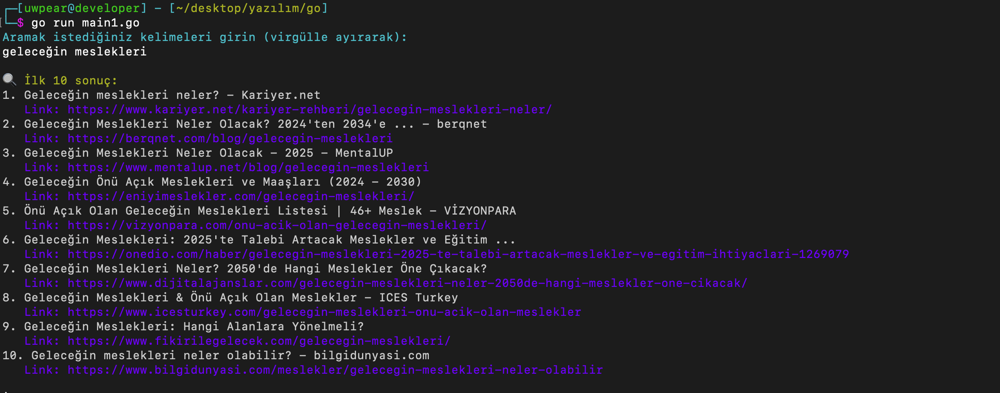
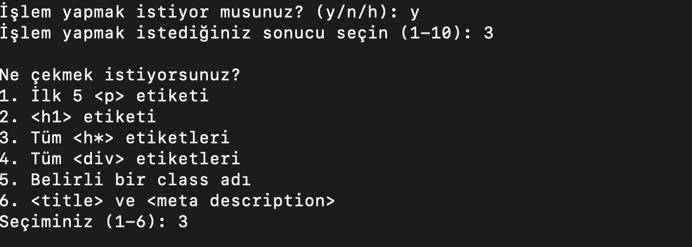
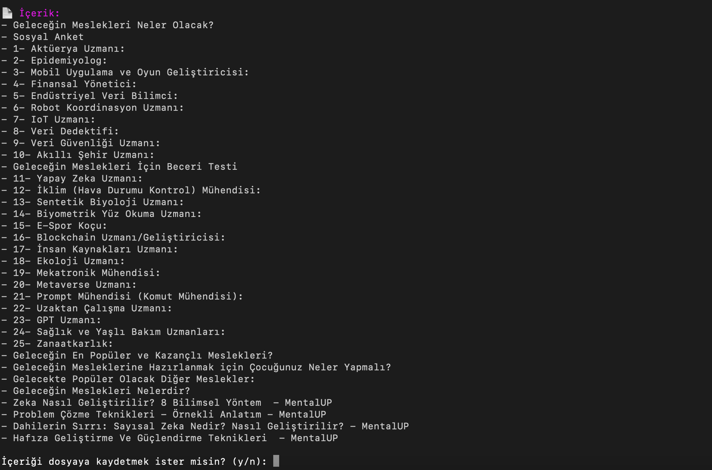
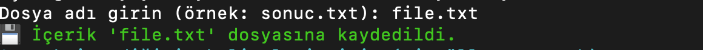
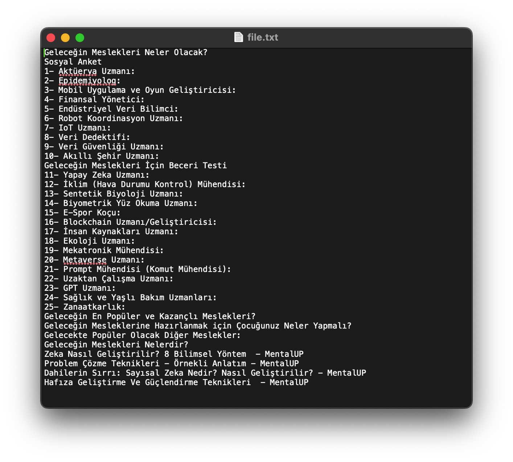

====================**'DEMO VERSİYON:'**====================

- **Dil desteği olarak Türkçe var.**
- **Anahtar kelimeler ile ilk 10 sonucu bizlere veriyor.**
- **5 farklı HTML etiketi çekme işlemini bizlere sunuyor.**
- **İçerikleri manuel olarak kaydetme.**
- **_Basit_ filtreleme işlemleri.**

=================================================================

====================**'ÜCRETLİ VERSİYON:'**====================
- **Türkçe, İngilizce, Rusça, Fransızca, Almanca ve daha fazla...**
- **Akıllı arama, daha fazla sonuç ve öneriler (AI destekli)** => geliştiriliyor...
- **Akıllı içerik özetleme ve gelişmiş etiket çekme** => geliştiriliyor...
- **Otomatik kaydetme ve düzenleme**
- **Veritabanı dosyasını JSON ve CSV formatlarına dönüştürme**
- **_Yapay zeka destekli_ arama ve içerik önerileri** => geliştiriliyor...
- **Kullanıcının geçmişine göre öneriler** => geliştiriliyor...
- **İçerik kategorileri ve akıllı filtreleme
ve daha fazlası...**
==================================================================
**İletişim => Telegram: @uwpear**
==================================================================
--
Fotoğraflar:

